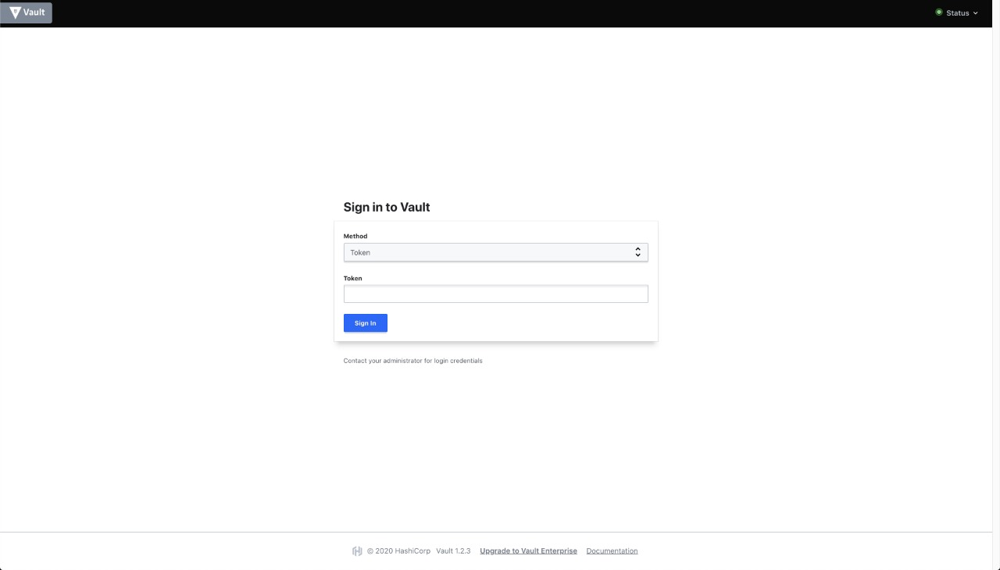
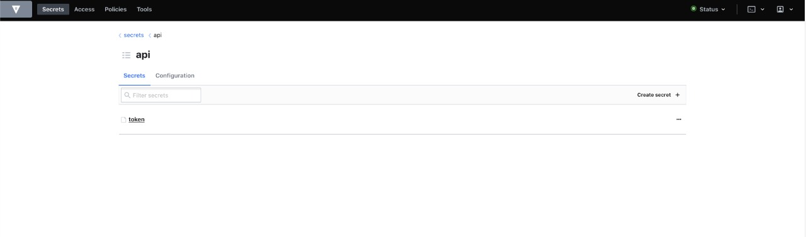
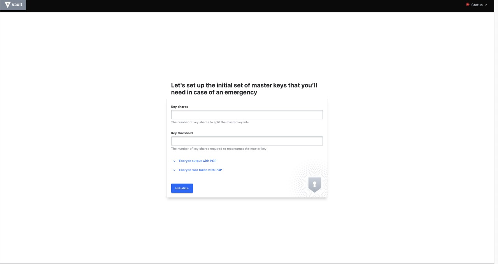
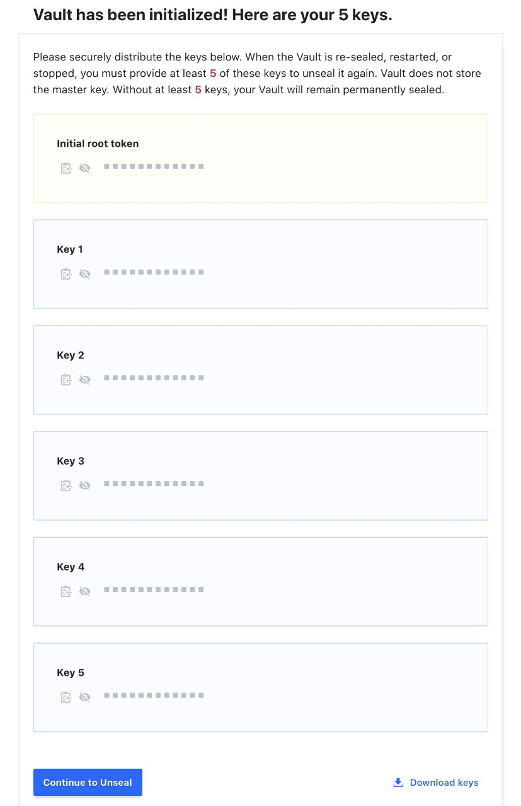
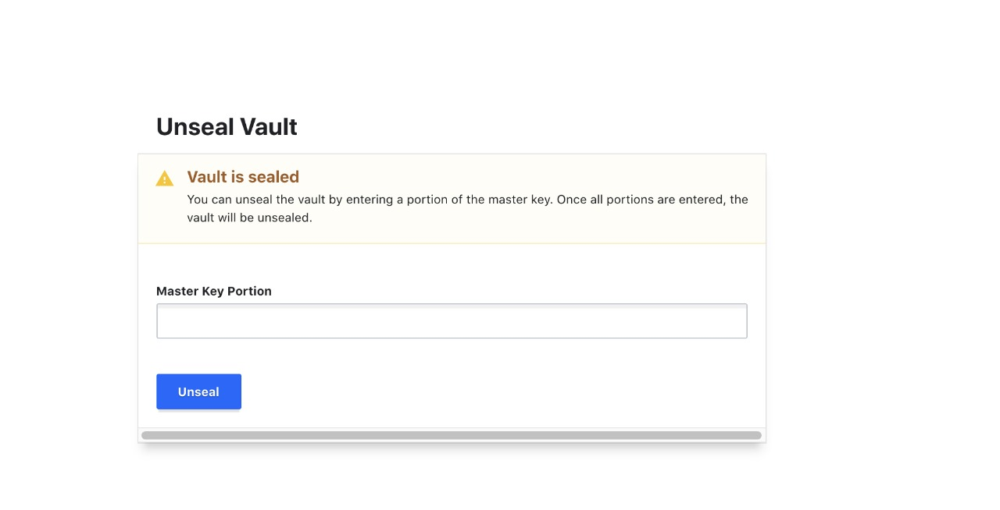

 # HashiCorp Vault

Nesse artigo vamos aprender sobre o Vault, uma poderosa ferramenta para gerenciamento de API Keys, Password, certificados e outras informações sensíveis de uma aplicação de software.

A internet vem mudando constantemente, neste últimos 20 anos vimos uma transformação sem precedentes no que se diz respeito a comunicação, principalmente a online, gracas a essa mudança podemos observar uma forte confiança exagerada a respeito de dados sensíveis da nossa aplicação, vemos muitos desenvolvedores, principalmente os iniciantes, com uma confiança exagerada em pensar que seus sistemas, banco de dados e websites nunca serão invadidos. 

Atualmente vejo o Vault como uma solução de extrema importância para o gerenciamento de chaves no ecossistema blockchain, pois nos últimos anos,  vimos uma crescente onda de ciber ataques principalmente em exchanges centralizadas onde fazem o gerencialmente das private keys e public keys. Na comunidade blockchain temos uma frase que ilustra bem o perigo de ter uma private key exposta, ela se expressa assim, " If You Don’t Own Your Keys, You Don’t Own Your Crypto" , ou seja, possuir essa informação pode custar milhões de dólares dependendo de qual chave privada o criminoso tenha acesso, neste tutorial não irei me aprofundar sobre conceitos básicos de criptografia simétrica e assimétrica, caso tenham interesse nessa assunto deixem nos comentários que farei um novo artigo direcionado a esse tema.

Percebendo os problemas citados acima, resolvi desenvolver esse tutorial com um passo a passo de como configurar, testar e realizar o deploy do Vault em seu server.

Vault e uma ferramente open-source gerida pela licença MPL-2.0 com permissão em uso comercial, então, não ha motivos para não usa-la, principalmente se você tem uma exchange de cripto, ou trabalha em uma.

## Configurações

Nesse tutorial vamos usar o modelo de contêiner em Docker, pois creio que para quem esta iniciando e a maneira mais rápido e fácil instalar, testar e configurar. 

### Step 1 -  Instale o Docker:

```
https://docs.docker.com/engine/install
```

### Step 2 - Configurar o Ambiente de Desenvolvimento

Va ao link do [contêiner](https://hub.docker.com/_/vault) ou apenas digite em seu terminal o comando
```bash
docker pull vault
```
Neste momento, voce pode receber a seguinte mensagem:

```bash
Cannot connect to the Docker daemon at unix:///var/run/docker.sock. Is the docker daemon running?
```
Isso acontece porque voce nao esta iniciando o docker, localize em seu gerenciador de aplicativos o docker e o inicie.

### Step 3 - Configurar Vault em Ambiente de desenvolvimento

Para configurar o vault, precisamos apenas digitar no terminal a seguinte instrução:

```bash
docker run --rm --cap-add=IPC_LOCK -e VAULT_ADDR=http://localhost:8200 -p 8200:8200 -d --name=dev-vault vault:1.2.2
```

O que cada parâmetro significa:

**docker run** = nome auto-explicativo.

**--cap-add=IPC_LOCK** = Esse comando bloqueie a memória, o que impede que esta seja salva o disco, quando voce desligar o container ele sera excluído automaticamente.

**-e*** = environment variable

**VAULT_ADDR=http://localhost:8200** = o mesmo que definir export VAULT_ADDR='http://0.0.0.0:8200' dentro do container.

**-d** = Significa Daemon, irá subir o container com serviço dentro do docker.

**--name=dev-vault** = nome do container (pode escolher qualquer um da sua escolha).

**vault** = container.


#### Step 3-1 - Verificar a instalação em modo desenvolvimento
<a name="instalacao"></a>

digite no seu terminal o comando:
```bash
docker ps
```

Se tudo deu certo irá mostrar no seu terminal algo parecido com isso:
```bash
CONTAINER ID        IMAGE               COMMAND                  CREATED             STATUS              PORTS                    NAMES
5e6ae499818f        vault:1.2.3         "docker-entrypoint.s…"   2 minutes ago       Up 2 minutes        0.0.0.0:8200->8200/tcp   dev-vault
```
Outro sinal para verificar se vault esta funcionando é ir até seu navegador principal e digitar
```http://localhost:8200 ``` 

você irá ver uma tela igual a imagem a baixo, se ate aqui tudo esta funcionando, podemos continuar, mas se por algum motivo, o seu navegador nao exibir esse tela, comece o processo totalmente do zero, pois algum passo nao foi seguido corretamente.



#### Step 4 - login
<a name="login"></a>

Como nos percebemos ao tentar acessar a UI do Vault ele solicita um token, mas ate o presente momento nao geramos nenhuma chave, isso porque ela ja foi gerada.

Para ter acesso ao token temos que acessar o nosso container que foi criado, o comando é o seguinte:

**Listamos os containers**
```bash
docker ps 
```
```
CONTAINER ID        IMAGE               COMMAND                  CREATED             STATUS              PORTS                    NAMES
5e6ae499818f        vault:1.2.3         "docker-entrypoint.s…"   2 minutes ago       Up 2 minutes        0.0.0.0:8200->8200/tcp   dev-vault
```
**Acessamos o containers**
```
docker logs [YOUR-CONTAINER-ID]  
```
No meu caso ficou assim:
```bash
docker logs 5e6ae499818f
```
```bash
You may need to set the following environment variable:

    $ export VAULT_ADDR='http://0.0.0.0:8200'

The unseal key and root token are displayed below in case you want to
seal/unseal the Vault or re-authenticate.

Unseal Key: xYOUR-UNSEAL-KEY=
Root Token: s.YOUR-KEY

Development mode should NOT be used in production installations!

==> Vault server started! Log data will stream in below:
```
Depois desse passo, ou seja, logo no final do console voce vera dois campos, o primeiro chamado **Unseal Key**, essa chave é usada para desbloquear o vault, nao é importante por enquanto, visto que estamos em ambiente de desenvolvimento. O outro campo é **Root Token** é esta chave que estamos procurando, copie ela com o **s.** e coloque na UI e depois clique em **Sign In**.

Vá ate o menu ``Secrets`` -> ``Enable a Secrets Engine`` -> ``kv``  -> ``Path``: ``api`` -> ``Version``: ``1`` -> ``clicar em method opinion``

Alterar os campos: ``seleciona a versão 1`` em ``Default Lease TTL`` e ``Max Lease TTL`` altera para ``7 days``.

Clique em ``Enable Engine`` para salvar.


### Criando, Lendo e Atualizando Chaves
<a name="criando"></a>

Neste passo vou usar a linguagem ``JavaScript``, mas voce pode usar qualquer linguagem que se sentir confortável, veja todas as libs neste [link](https://www.vaultproject.io/api-docs/libraries).

Vamos criar um projeto com nodejs, no seu terminal digite:

``1 - Criar pasta do projeto``
```
mkdir [Nome do seu projeto ] && cd [Nome do seu projeto ]
```
``2 - Iniciar o projeto``
```bash
yarn init -y
```
``2 - Adicionar a lib do Vault``
```bash
yarn add node-vault
```

Abra seu projeto com o Visual Code, caso voce nao tenha o visual code pode fazer download nesse [link](https://code.visualstudio.com/).

Eu ja adicionei o **Visual Code** no meu **PATH** para abrir ele pelo terminal, sem precisar setar pasta ou ir em open project agilizando o processo de desenvolvimento diário, para verificar digite no terminal a seguinte instrução.
```bash
code ./
```

Vamos primeiramente estruturar nosso projeto:
```bash
  mkdir src && cd src 
  mkdir config && cd config
```
Dentro da pasta ``config`` vamos criar nosso primeiro arquivo de conexão do Vault com o nome ``vault.js``, abra esse arquivo de cole o seguinte codigo.

```javascript
module.exports = {
  apiVersion: "v1",
  endpoint: process.env.endpoint || "http://localhost:8200",
  token: process.env.tokenVault || "SEU TOKEN ROOT",
};
```
```apiVersion```: numero da versão da api, podendo ser *v1* ou *v2*.

```endpoint```: endpoint de conexão com a api.

```token```: token de acesso da api.

Voltamos a pasta **src**: 
```bash
cd ../
```
Agora vamos criar nossa pasta `services`:
```bash
mkdir services && cd services
```
Crie um arquivo com o nome `VaultService.js` e cole o seguinte código.

```javascript
const options = require('../config/vault')
const vault = require("node-vault")(options);

class VaultService {

  async write(path, data) {
    const params = JSON.parse(`{"value": "${data}"}`);
    vault
      .write(path, params)
      .catch(console.error);
  }

module.exports = new VaultService();
```
Importamos a instancia do vault e declaramos nossos parâmetros de conexão
```javascript
const options = require('../config/vault')
const vault = require("node-vault")(options);
```
Apos isso criamos e exportamos uma classe com o nome `VaultService`.
```javascript
const options = requir('../config/vault')
const vault = require("node-vault")(options);

class VaultService {}

module.exports = new VaultService();
```
Por fim criamos uma método que terá como responsabilidade de inserir dados nas chaves que definirmos, recebendo dois parâmetros `path` e `data`. O campo `path` recebe o caminho onde sera armazenado os dados em `data`.
```javascript
const options = require('../config/vault')
const vault = require("node-vault")(options);

class VaultService {

  async write(path, data) {
    const params = JSON.parse(`{"value": "${data}"}`);
    vault
      .write(path, params)
      .catch(console.error);
  }

module.exports = new VaultService();
```
vamos voltar a pasta `src`e criar um novo arquivo `index.js` e colocar o código:

```bash
cd ../
```

```javascript
const vaultService = require('./services/VaultService');

const syncVault = async () => {
  await vaultService.execute('api/token', 'xxxxxxxxxxxxxxxx');
}

syncVault();
```
Vamos entender o que esta acontecendo, primeiramente nos declaramos uma instancia nova chamada ``vaultService``.

```javascript
const vaultService = require('./services/VaultService');
```

Declaramos um método com o nome ``syncVault`` que sera chamada invocada pelo ``nodejs`` na hora da execução do script ``index.js``.

```javascript
const vaultService = require('./services/VaultService');

const syncVault = async () => {}

syncVault();
```
Agora chamamos o método responsável pela escrita no vault.

```javascript
const vaultService = require('./services/VaultService');

const syncVault = async () => {
  await vaultService.write('api/token', 'xxxxxxxxxxxxxxxx');
}

syncVault()
```

Para rodar o script vamos criar link para chama-lo, abrimos o arquivo `package.json` e criamos uma nova tag chamada `scripts` e salvamos.
```json
{
  "name": "voult-project",
  "version": "1.0.0",
  "main": "index.js",
  "license": "MIT",
  "scripts": {
    "dev": "node ./src/index.js"
  },
  "dependencies": {
    "node-vault": "^0.9.18"
  }
}
```

Agora no terminal digitamos:
```bash
yarn dev
```

Se tudo funcionar sera mostrado algo assim: 
```bash
❯ yarn dev
yarn run v1.17.3
$ node ./src/index.js
✨  Done in 0.47s.
```
A duas formas de verificar a criação da chave, a primeira pelo UI do Vault.

Acesse http://localhost:8200/ insira sua chave e clique em ``Sign In``.

Va em Secrets -> API:


Ou podemos verificar pelo script, vamos abrir novamente nosso arquivo ``VaultService.js`` e vamos adicionar o seguinte método:

```javascript
  async read(path) {
    try {
      return await vault.read(path);
    } catch (error) {
      console.error(error);
    }
  }
```
ficando assim o arquivo completo:

```javascript
const options = require('../config/vault');
const vault = require("node-vault")(options);

class VaultService {
  async write(path, data) {
    try {
      const params = JSON.parse(`{"value": "${data}"}`);
      vault.write(path, params).catch(console.error);
    } catch (error) {
      console.error(error);
    }
  }

  async read(path) {
    try {
      return await vault.read(path);
    } catch (error) {
      console.error(error);
    }
  }
}

module.exports = new VaultService();
```

Abrimos nosso arquivo ``index.js`` e chamamos o método que acabamos de criar:

```javascript

const vaultService = require('./services/VaultService');

const syncVault = async () => {
  await vaultService.write('api/token', 'xxxxxxxxxxxxxxxx');

  const { data } = await vaultService.read("api/token");
  console.log(data);
}

syncVault();

```

executamos nosso script novamente e temos o seguinte retorno. Observe que o resultado 
```bash
❯ yarn dev
yarn run v1.17.3
$ node ./src/index.js
{ value: 'xxxxxxxxxxxxxxxx' }
✨  Done in 0.42s.
```

Caso receba o erro 404, quer dizer que sua chave nao foi criada.
```
❯ yarn dev
yarn run v1.17.3
$ node ./src/index.js
{ Error: Status 404 }
```


## VAMOS AO DEPLOY 

Nosso deploy sera feito totalmente com o docker, pois essa e a forma mais eficiente de ser implementado na minha opinião.

Bem escolham uma VPN ou Amazon ECS, irei utilizar uma VPN nesse exemplo, mas garanto que nao a curva de implantação nao possui muita diferença pois essa e a filosofia do Docker.

Crie uma pasta no seu projeto chamada ``Docker`` e dentro dela uma pasta chamada ``vault``e outra chamada ``consul``, caso nao lembre, no console voce pode digitar:
```
mkdir docker && cd docker && mkdir vault && mkdir consul && cd vault
```

### Vault

dentro da pasta vault vamos criar um arquivo chamado `Dockerfile` que sera responsável pela configuração do container ``vault``.

neste arquivo voce ira colar as seguintes configurações:
```dockerfile
# base image
FROM alpine:3.7

# define a versão do vault
ENV VAULT_VERSION 1.2.3

# cria um novo repositório
RUN mkdir /vault
RUN mkdir /vault/keys

# faz download da dependência
RUN apk --no-cache add \
      bash \
      ca-certificates \
      wget

# faz download da imagem do vault
RUN wget --quiet --output-document=/tmp/vault.zip https://releases.hashicorp.com/vault/${VAULT_VERSION}/vault_${VAULT_VERSION}_linux_amd64.zip && \
    unzip /tmp/vault.zip -d /vault && \
    rm -f /tmp/vault.zip && \
    chmod +x /vault

# definea variavel de ambiente PATH que o vault ira utilizar.
ENV PATH="PATH=$PATH:$PWD/vault"

# copia o arquivo de configuração do vault
COPY ./config/vault-config.json /vault/config/vault-config.json

# copia as o certificados para comunicação Https
COPY ./fullchain.pem /vault/keys/public.pem
COPY ./privkey.pem /vault/keys/private.pem

# libera a port 8200
EXPOSE 8200

# executa o vault
ENTRYPOINT ["vault"]
```
Agora iremos criar uma nova pasta chamada ``config``:
```bash
mkdir config && config
```
Criamos um arquivo com o nome ``vault-config.json``, por padrão o vault ira buscar o arquivo com esse novo para iniciar em modo ``server``.

Nosso arquivo ficará assim:

```json
{
  "backend": {
    "consul": {
      "address": "consul:8500",
      "path": "vault/"
    }
  },
  "listener": {
    "tcp": {
      "address": "0.0.0.0:8200",
      "tls_disable": 1,
      "tls_cert_file": "/vault/keys/public.pem",
      "tls_key_file": "/vault/keys/private.pem"
    }
  },
  "ui": true
}
```
**EXPLICAÇÃO**


```json
{
"backend": {
    "consul": {
      "address": "consul:8500",
      "path": "vault/"
    }
  },
}
```
``"backend"``: Definimos o nosso servidor storage no qual será o ``"consul"`` com endereço ``consul:8500`` caminho ``vault/``.

```json
"address": "consul:8500",
```
neste trecho o caminho ``consul:8500`` pode gerar alguma duvida as pessoa nao habituadas com o docker, este endereço e o mesmo que eu definir uma network, exemplo ``network``: ``consul``=``127.0.0.1``, assim posso chamar a rede por consul, e todos os container que herdarem essa rede pode chama-la pelo nome e nao pelo seu ip.

```json
{
"listener": {
    "tcp": {
      "address": "0.0.0.0:8200",
      "tls_disable": 0,
      "tls_cert_file": "/vault/keys/public.pem",
      "tls_key_file": "/vault/keys/private.pem"
    }
  },
}
```
``"listener"`` Configura como o Vault atende as solicitações de API, ou seja, fica ouvindo as requisições na porta ``8200``, apos isso é definido as configurações https, é extremamente recomendado em produção, ser implementado com https, nao preciso dizer o motivo certo?

``"tls_disable": 0`` define a obrigatoriedade de fornecer o certificado e a privatekey do certificado.

``"tls_cert_file"`` define o caminho do certificado dentro do container e nao dentro da sua maquina.

``"tls_key_file"`` define o caminho da chave privada dentro do container e nao dentro da sua maquina.

```json
{
  "ui": true
}
```
``"ui"`` habilita interação com a ui, caso nao veja necessidade, informe como ``false``.

**IMPORTANTE**

caso deseje mudar o nome, nao esqueça de mudar esse arquivo no ``Dockerfile`` ficando assim:

```dockerfile
# copia o arquivo de configuração do vault
COPY ./config/[NOME-DO-SEU-ARQUIVO].json /vault/config/vault-config.json
```
perceba que o ``/vault/config/vault-config.json`` continua inalterado, isso porque o vault ira buscar o arquivo padrão de configuração com o nome ``vault-config.json``.

### Consul

Acesse a pasta Consul e crie um arquivo chamado `Dockerfile` dentro dele cole as seguintes configurações.

```dockerfile
# base image
FROM alpine:3.7

# define a versão do consul
ENV CONSUL_VERSION 1.7.4

# cria um novo repositório
RUN mkdir /consul

# faz download da dependência
RUN apk --no-cache add \
      bash \
      ca-certificates \
      wget

# az download da imagem do consul
RUN wget --quiet --output-document=/tmp/consul.zip https://releases.hashicorp.com/consul/${CONSUL_VERSION}/consul_${CONSUL_VERSION}_linux_amd64.zip && \
    unzip /tmp/consul.zip -d /consul && \
    rm -f /tmp/consul.zip && \
    chmod +x /consul/consul

# definea variavel de ambiente PATH que o consul ira utilizar
ENV PATH="PATH=$PATH:$PWD/consul"

# copia o arquivo de configuração do consul
COPY ./config/consul-config.json /consul/config/config.json

# libera as portas
EXPOSE 8300 8400 8500 8600

# executa o consul
ENTRYPOINT ["consul"]

```

Agora iremos criar nosso arquivo de configuração, digite no console:

```bash
mkdir config && cd config
```

Dentro dessa pasta criamos um arquivo chamado ``consul-config.json`` com as seguintes configurações.

```json
{
  "datacenter": "localhost",
  "data_dir": "/consul/data",
  "log_level": "DEBUG",
  "server": true,
  "ports": {
    "dns": 53
  }
}
```

### **Deploy**

#### Step 1 -  Instale o Docker e docker-compose:

```
https://docs.docker.com/engine/install
https://docs.docker.com/compose/install
```
#### Step 2 -  Instale o certbot:

Antes de tudo precisamos gerar nosso certificado, vamos usar o ``Certbot``:
```bash
sudo apt-get update
sudo apt-get install software-properties-common
sudo add-apt-repository universe
sudo add-apt-repository ppa:certbot/certbot
sudo apt-get update
sudo apt-get install certbot
```
E depois de tudo instalado podemos gerar nosso certificado seguindo os passos da própria ferramenta. Vale lembrar que para voce gerar um certificado para usar o ``HTTPS`` devera primeiro apontar su domínio para o DNS do servidor ou host.

```bash
sudo certbot certonly --standalone
```

envie seus dados para o servidor, no meu caso ficou assim
```
git clone https://github.com/Dkdaniz/HashiCorp-Vault-post-medium
```

Agora precisamos acessar a pasta do seu dominio que contem o seu certificado digital.
```bash
cd /etc/letsencrypt/live/[SEU DOMINIO]/
```
``OBSERVACAO``: Esse procedimento precisa de acesso de admin a pasta `/etc/letsencrypt/live/`

Copie os arquivos os arquivos ``fullchain.pem`` e ``privkey.pem``

```bash
cp ./fullchain.pem /home/[YOUR-USER]/[NOME-DO-SEU-PROJETO]/docker/vault
cp ./privkey.pem /home/[YOUR-USER]/[NOME-DO-SEU-PROJETO]/docker/vault
```
```bash
#No meu caso ficara assim
cp ./fullchain.pem /home/dkdaniz/HashiCorp-Vault-post-medium/docker/vault
cp ./privkey.pem /home/dkdaniz/HashiCorp-Vault-post-medium/docker/vault
```
Voltamos a pasta do nosso projeto e executamos o docker-compose
```bash
cd /home/[YOUR-USER]/[NOME-DO-SEU-PROJETO]
```
Executamos o ``docker-compose``:
```bash
docker-compose up -d --build
```

va no navegador e verifique se aparece a tela inicial do vault acesse:
```
https://YOUR-HOST.com:8200
```
voce vera o Vault em estado ``sealed``, ou seja, nessa etapa precisamos informar quantas chaves sao necessarias para realizar o desbloqueio do vault, nesse exemplo irei utilizar 5 keys.



Logo apos definir que pretendo usar cinco chaves ele, ira ficar disponivel download json contendo as suas chaves, faca o download clicando em ``download keys``e depois inicie o processo de ``Unseal``.

Ele ira mostrar um aviso para voce: 

```
Por favor, distribuir com segurança as chaves abaixo. Quando o cofre for selado de novo, reiniciado ou parado, deverá fornecer pelo menos 5 destas chaves para o voltar a deslindar. O cofre não armazena a chave-mestra. Sem pelo menos 5 chaves, o seu Cofre ficará permanentemente selado.
```


clicando em ``Continue Unseal`` a UI ira lhe mostrar um tela solicitando as chave:



Informe as keys e apartir desse momento voce devera inserir sua chave de root ou qualquer outra que voce tenha criado.


